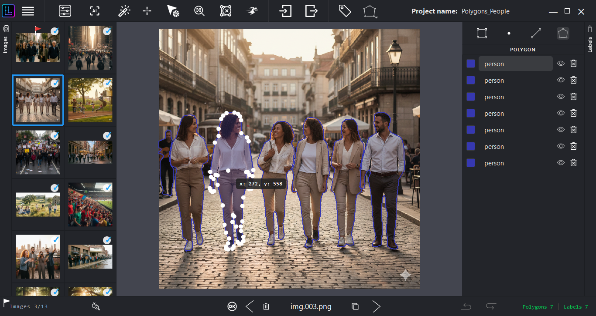
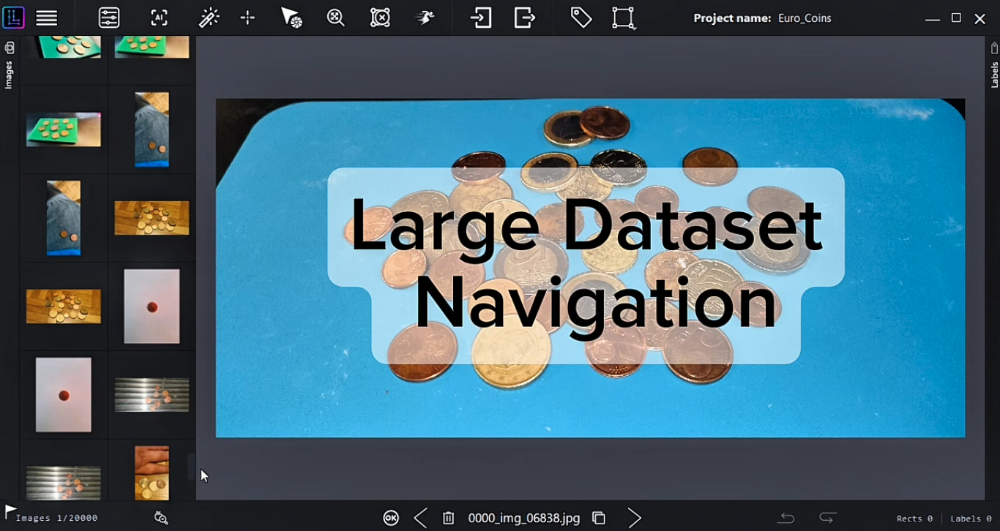
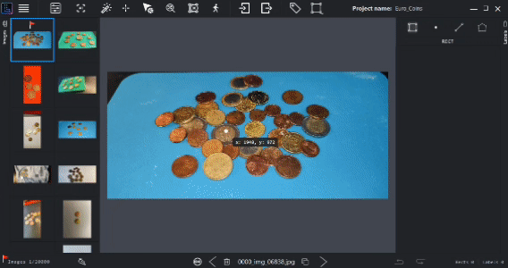
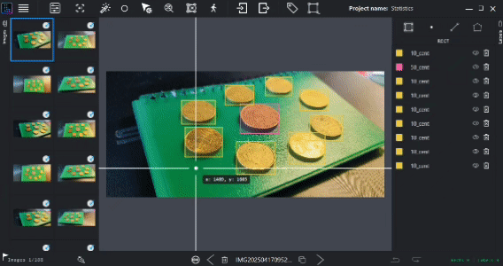
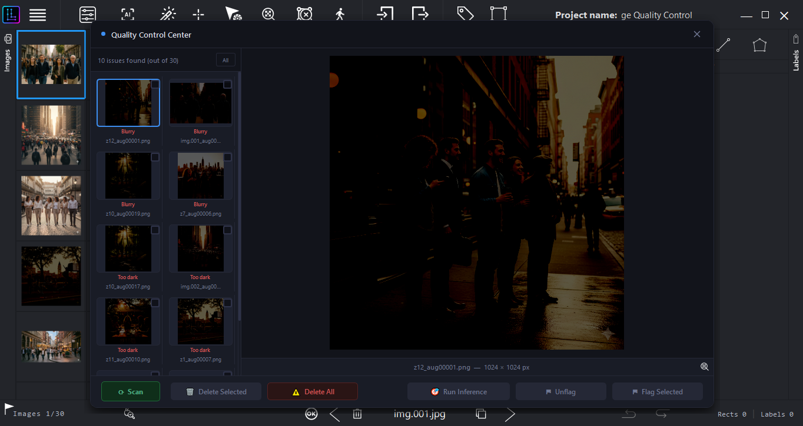
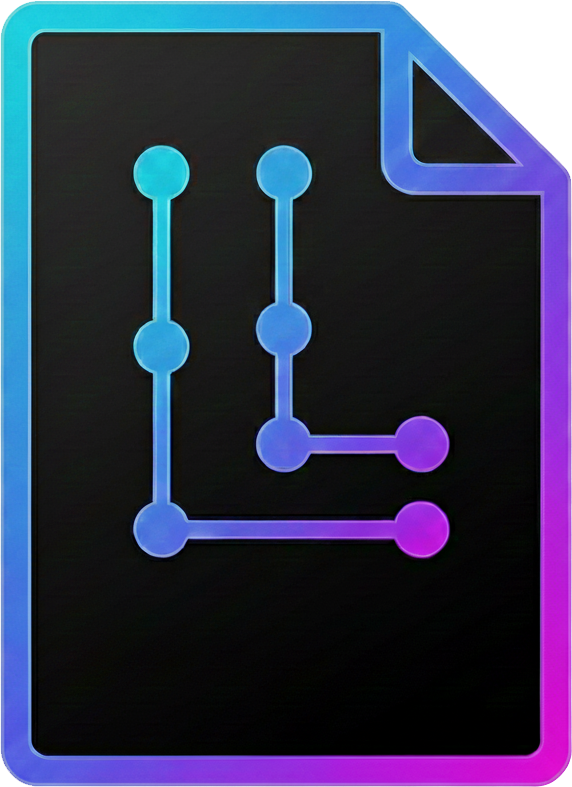
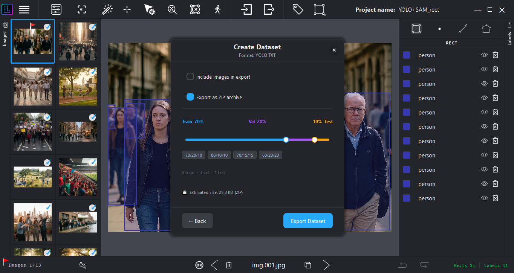

# LensLaber

Offline-first annotation tool for computer vision datasets.


Fast, lightweight, and practical annotation workflows for large computer vision datasets—built to deliver high performance without relying on cloud services or high-end hardware.

---

## 🛠️ The Philosophy: Built for Limited Hardware

Many modern annotation tools assume you have infinite RAM, a high-end dedicated GPU, or a constant high-speed internet connection. LensLaber was built on the exact opposite principle. 

To ensure absolute optimization, this software was developed entirely on a legacy laptop with limited resources:
* **Processor:** Intel® Core™ i5-4200U CPU @ 1.60GHz (2.30 GHz)
* **Installed RAM:** 8.00 GB (7.89 GB usable)
* **Storage:** 112 GB SSD SanDisk
* **Graphics:** NVIDIA GeForce 820M (980 MB) / Intel® HD Graphics Family

**The Result:** A native engine that runs automated detection and segmentation workflows (**YOLO + SAM Mobile**) locally on hardware from 2015/2016 (even tested smoothly on an Intel i3 with 4 GB RAM). Performance metrics vary depending on hardware specifications and dataset characteristics, but typical scenarios show:
* **RAM Usage:** Approximately 600–900 MB (varies based on image dimensions and dataset size)
* **CPU Usage:** Approximately 20–35% during AI inference (varies based on model complexity and hardware capabilities)

The goal is simple:
* **100% Offline operation** (absolute data privacy, no cloud uploads, no telemetry).
* **High responsiveness** on modest or legacy hardware.
* **Frictionless workflows** for large-scale dataset creation.

---

## 🛡️ Security, Transparency & Installation

LensLaber is proprietary software distributed as a standalone Windows executable (`.exe`). Because your data security and peace of mind are paramount, we provide total transparency:

### ⚠️ Windows SmartScreen Notice
As an independent beta release, this installer does not yet carry a costly commercial EV Code Signing Certificate. Therefore, Windows SmartScreen will likely display a blue warning screen (*"Windows protected your PC / Unknown Publisher"*) when you run the installer.
* **To proceed:** Click on **"More info"** and then select **"Run anyway"**.

### Audit the Security Yourself:
* **Developer Identity:** Fully transparent. Connect with the creator directly:
  - [LinkedIn Profile – Clemente O.](https://www.linkedin.com/in/clemente-o-97b78a32a?utm_source=share_via&utm_content=profile&utm_medium=member_android)
  - [GitHub Profile – LensLaber](https://github.com/LensLaber)
* **VirusTotal Live Analysis:** View the completely clean, untampered report directly on the official servers via this [VirusTotal Live Link (0/64 Clean)](https://www.virustotal.com/gui/file/82293fe17d8d32c9c882b2ab742926d4b1967274a929c5f38df449f543e6155d/detection).
* **Official SHA-256 Checksum:** `82293fe17d8d32c9c882b2ab742926d4b1967274a929c5f38df449f543e6155d`

#### How to verify file integrity on Windows:
1. Open **PowerShell** in the directory where the installer was downloaded.
2. Run the following command:
   ```powershell
   Get-FileHash .\LensLaber_Beta_Setup_v0.9.0.exe -Algorithm SHA256
   ```

---

## ✨ Main Features

- **Bounding Boxes** – Fast box-based annotation
- **Polygons** – Precise pixel-level segmentation
- **Points** – Keypoint and landmark annotation
- **Lines** – Linear feature annotation
- **Fast Mode** – Rapid class assignment workflow
- **YOLO ONNX Integration** – Local AI-assisted detection
- **SAM Mobile Integration** – CPU-optimized segmentation refinement
- **Confidence-based False Negative Review** – Automated quality control
- **Dataset Filtering** – Intelligent image organization
- **Dataset Statistics** – Real-time annotation metrics
- **Image Quality Control** – Pre-export validation tools
- **Project Save/Load System** – Persistent workflow state (`.lens` format)
- **Dataset Export** – Train/Validation/Test splits with ZIP packaging
- **Built-in Augmentations** – On-the-fly dataset transformations
- **Configurable Shortcuts** – Fully customizable keyboard controls
- **Adaptive Cursor** – Context-aware interface feedback
- **Autosave** – Automatic progress preservation

---

## 🎯 Main Workspace



The main workspace is designed to provide a fast and practical annotation experience with quick access to datasets, classes, tools and workflows.

---

## 📊 Large Dataset Workflow



▶ **Video Demo:**
https://lenslaber.github.io/media/videos/large_dataset_workflow.mp4

LensLaber is engineered to remain responsive when working with large image collections.

Key capabilities include:

- **Thumbnail Navigation** – Visual browsing of thousands of images
- **Multi-selection** – Batch operations on multiple images
- **Fast Image Switching** – Instant navigation between frames
- **Dataset Organization Tools** – Hierarchical folder management and filtering

**Tested successfully with datasets containing 20,000+ images.**

---

## ⚡ Fast Mode


Fast Mode enables rapid class assignment during annotation, minimizing repetitive UI interactions and dramatically accelerating dataset creation workflows.

---

## 🤖 YOLO Integration


LensLaber supports user-provided YOLO ONNX models for automated object detection workflows.

This integration enables:
- **Model-Assisted Workflows** – Accelerate annotation using your own trained models
- **Local Processing** – All inference runs offline on your hardware
- **Custom Model Support** – Use any YOLO ONNX-compatible model architecture

---

## 🔗 YOLO + SAM Workflow


This advanced workflow combines YOLO-based detection with SAM Mobile-assisted refinement, delivering semi-automatic annotation while maintaining full manual control.

**Typical benefits include:**

- **Faster Object Initialization** – YOLO provides accurate bounding boxes
- **Reduced Manual Adjustment** – SAM refines segmentation masks automatically
- **Improved Efficiency** – Significant speed gains on repetitive datasets
- **Practical Semi-Automation** – Human oversight at every step

---

## 🔍 False Negative Review


After automated detection, LensLaber can optionally highlight low-confidence predictions for manual review and verification.

**Features:**
- **Configurable Confidence Threshold** – Customize sensitivity based on your needs
- **Automatic Flagging** – Potential missed objects are automatically highlighted
- **Quality Assurance** – Ensures comprehensive dataset coverage

*Note: Enabling this feature increases processing time proportionally to dataset size.*

---

## 📱 SAM Mobile Integration


LensLaber integrates SAM (Segment Anything Model) Mobile—optimized for CPU-based workflows on modest hardware.

**Current capabilities:**
- **CPU Optimization** – Runs efficiently on systems without dedicated GPUs
- **Fast Segmentation** – Real-time mask prediction and refinement

**Future enhancements:**
- Optional GPU/CUDA acceleration for users with compatible hardware
- Support for larger SAM model variants

---

## 🎛️ Filtering System



Combine multiple filters to efficiently locate images, annotations, or review targets within large datasets.

**Use cases:**
- Find images with specific classes
- Identify incomplete or missing annotations
- Review low-confidence predictions
- Locate specific image quality issues

---

## 📈 Dataset Statistics



Real-time statistics dashboard provides actionable insights into dataset composition and annotation progress.

**Metrics include:**
- Class distribution and imbalance analysis
- Annotation completion percentage
- Image quality metrics
- Object density and size statistics

---

## 🔧 Image Quality Control



Image quality assessment tools help identify potential issues before dataset export or model training.

**Quality checks include:**
- Resolution and aspect ratio analysis
- Compression artifact detection
- Lighting and contrast evaluation
- Format compatibility verification

---

## 💾 Project System



Projects can be saved and restored using the `.lens` project format, providing complete workflow persistence.

**Preserved on save:**

- All annotations and metadata
- Review state and progress markers
- Active filters and view settings
- Complete workflow history

---

## 📦 Dataset Export



Flexible export workflows support multiple dataset preparation strategies.

**Export capabilities:**

- **Train/Validation/Test Splits** – Customizable data stratification
- **Optional Image Inclusion** – Export annotations only or with images
- **ZIP Packaging** – Single-file distribution format
- **Format Support** – Multiple annotation format options (YOLO, COCO, etc.)

---

## 🎨 Built-in Augmentations


LensLaber includes powerful on-the-fly dataset transformation capabilities for preparing training-ready datasets without external tools.

**Augmentation features:**

- **Geometric Transformations** – Rotation, flipping, perspective shifts
- **Color & Brightness** – Contrast adjustment, brightness variations, color jittering
- **Noise & Distortion** – Gaussian noise, blur, compression artifacts
- **Annotation-Aware** – All transformations preserve and adapt annotations accordingly
- **Batch Processing** – Apply augmentations to entire datasets during export
- **Seamless Integration** – Works directly within the export pipeline
- **Configurable Parameters** – Fine-tune transformation intensity and probability

**Use cases:**
- Generate diverse training datasets from limited source images
- Address class imbalance with synthetic variations
- Improve model robustness through data augmentation
- Eliminate dependency on external preprocessing tools

---

## 🏗️ Performance Philosophy

LensLaber is architected around practical workflows rather than hardware requirements.

**Design principles:**

- **CPU-First Operation** – Optimized for systems without discrete GPUs
- **Lightweight AI Integration** – Efficient implementation of YOLO and SAM Mobile
- **100% Offline Capability** – No cloud dependencies or data transmission
- **Memory Efficiency** – Minimal RAM footprint for rapid context switching

**Future roadmap:**
- Optional GPU/CUDA acceleration for compatible systems
- Support for larger SAM model variants
- Additional export format options
- Performance optimization for extreme-scale datasets

---

## 🖥️ Tested Environment

Current testing validation includes:

- **Operating System:** Windows 10 / Windows 11
- **Processor:** Intel i5-class (tested extensively on i5-4200U and i3 @ 4GB RAM)
- **Memory:** 8 GB RAM (functional at 4 GB with modest dataset sizes)
- **Graphics:** Integrated Intel UHD / NVIDIA 820M (CPU-primary workflow)

**Performance metrics:**
- Average RAM usage: ~600–900 MB (varies based on image dimensions and dataset characteristics)
- Average CPU usage: ~20–35% during AI inference (varies based on model complexity and hardware capabilities)
- Responsiveness: Maintained across 20,000+ image datasets

*Note: Performance varies depending on specific hardware configurations, dataset characteristics (image resolution, number of objects per image), and active features. Metrics provided represent typical scenarios on tested hardware.*

Compatibility with additional systems continues to improve with each release.

---

## ⚙️ Beta Status

LensLaber is currently in **public beta**. The software is production-ready and fully functional; however, please be aware of the following limitations:

### Beta Limitations

This beta version operates under the following temporary restrictions:

- **30-day usage limit** per installation
- **Maximum 1000 dataset exports per day**
- Some features may be incomplete, disabled, or under active development
- Performance and stability may vary depending on hardware and dataset size
- Windows SmartScreen warning on first run (known limitation)

These limitations are temporary and will be adjusted in future releases based on user feedback and deployment metrics.

---

## 🗺️ Roadmap

Planned improvements and enhancements:

- **GPU/CUDA Acceleration** – Optional hardware acceleration for compatible systems
- **Larger SAM Models** – Support for full SAM and SAM-2 variants
- **Additional Export Formats** – COCO Instance, Detectron2, and custom format support
- **Performance Optimization** – Sub-second image switching and batch operations
- **Advanced Workflow Enhancements** – Multi-user project collaboration, version control, and automated labeling pipelines

---

## 📣 Feedback & Support

We actively welcome:

- **Bug reports** – Help us identify and fix issues
- **Feature suggestions** – Share your workflow requirements
- **User feedback** – Tell us how LensLaber fits your pipeline
- **Performance insights** – Document your hardware and usage patterns

Please reach out through [GitHub Issues](https://github.com/LensLaber/LensLaber.github.io/issues) or connect directly with the creator.

---

## 📥 Download

**👉 [Download LensLaber Beta for Windows](https://github.com/LensLaber/LensLaber.github.io/releases/download/v1.0.0-beta/LensLaber_Beta_Setup_v0.9.0.exe)**

**📄 [Download SHA-256 Checksum](https://github.com/LensLaber/LensLaber.github.io/releases/download/v1.0.0-beta/LensLaber_Beta_Setup_v0.9.0.exe.sha256)**

---

## 🔒 Integrity Verification (SHA-256)

To verify that your downloaded installer is authentic and has not been altered or corrupted, validate the SHA-256 cryptographic hash.

**Official SHA-256 Hash:**
```
82293fe17d8d32c9c882b2ab742926d4b1967274a929c5f38df449f543e6155d
```

### Verify on Windows:

1. Open **PowerShell** in the directory containing the downloaded installer.
2. Execute the following command:
   ```powershell
   Get-FileHash .\LensLaber_Beta_Setup_v0.9.0.exe -Algorithm SHA256
   ```
3. Compare the output hash with the official hash above. They must match exactly.

### VirusTotal Verification:

View the complete, untampered antivirus analysis on VirusTotal's official servers:
[VirusTotal Report (0/64 Clean)](https://www.virustotal.com/gui/file/82293fe17d8d32c9c882b2ab742926d4b1967274a929c5f38df449f543e6155d/detection)

---

## 📜 License

LensLaber is proprietary software. This repository is intended for documentation, beta distribution, and project updates.

© 2026 LensLaber. All rights reserved.
